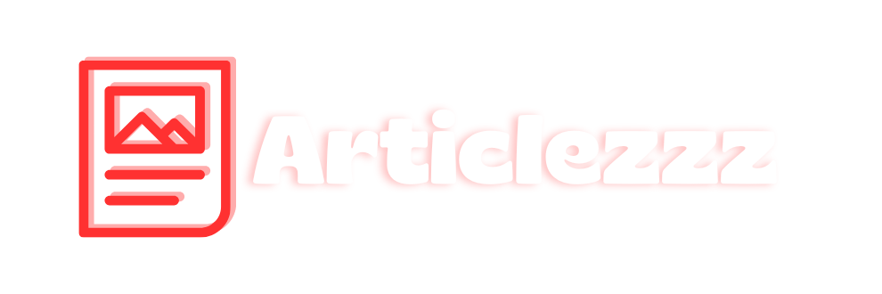
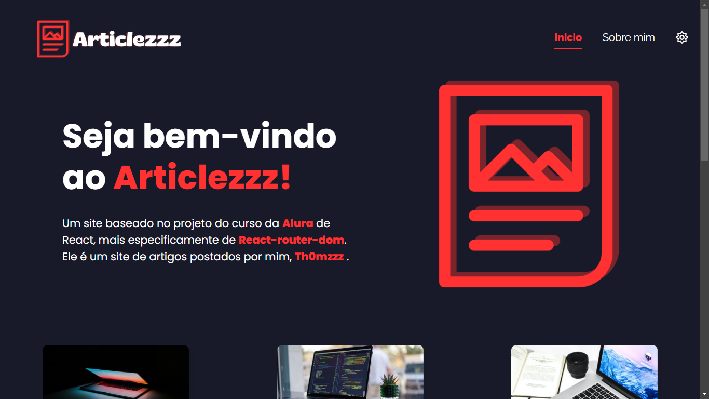
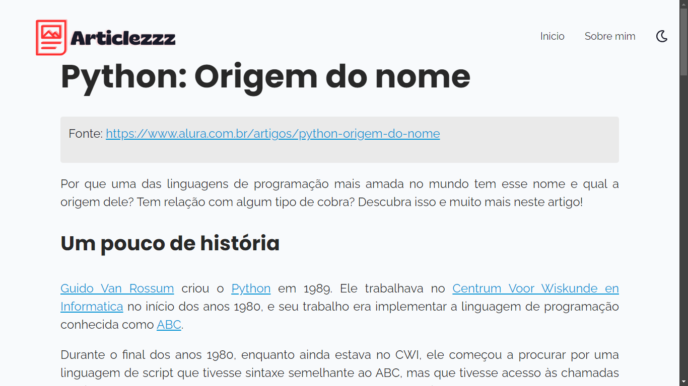

Um site baseado no projeto do curso da 
  <a href='https://www.alura.com.br/' rel="noreferrer" target="_blank" className='strong-text'>Alura</a> de React, mais especificamente de 
  <a href='https://reactrouter.com/' rel="noreferrer" target="_blank" className='strong-text'>React-router-dom</a>. Ele é um site de artigos postados por mim, 
  <a href='https://github.com/Th0mzzz' rel="noreferrer" target="_blank" className='strong-text'>Th0mzzz</a>

<a href='https://th0mzzz-articles.vercel.app/' target='_blank'> Acessar o projeto no Vercel</a>
